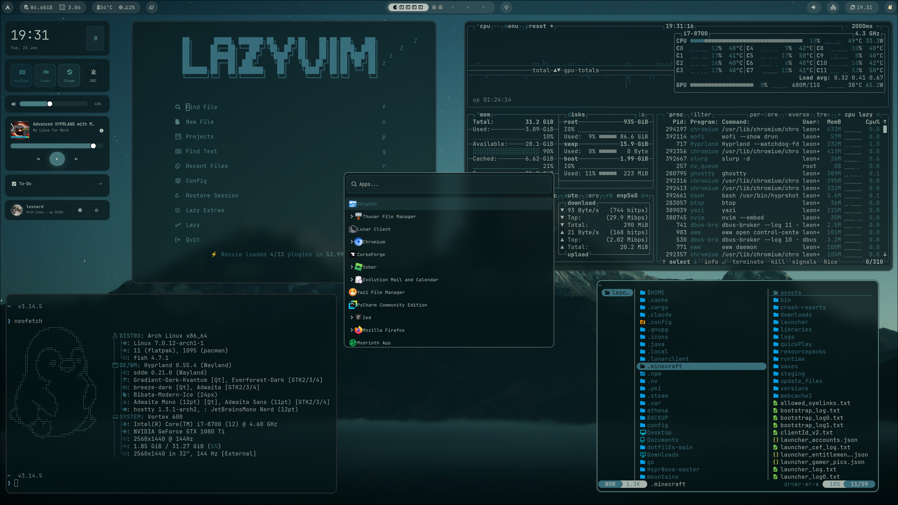

# MyDotfiles — Arch Hyprland Rice

Personal dotfiles for an Arch Linux + Hyprland setup with animated wallpapers, an EWW control center, pywal color theming, and a custom Waybar.

---

---

## Stack

| Role | Tool |
|---|---|
| Window Manager | [Hyprland](https://hyprland.org) |
| Terminal | [Ghostty](https://ghostty.org) |
| Shell | [Fish](https://fishshell.com) + [Starship](https://starship.rs) prompt |
| Editor | [Neovim](https://neovim.io) (LazyVim + pywal16 colorscheme) |
| Bar | [Waybar](https://github.com/Alexays/Waybar) |
| App Launcher | [Wofi](https://hg.sr.ht/~scoopta/wofi) |
| Widgets / Control Center | [EWW](https://github.com/elkowar/eww) |
| Notifications | [SwayNC](https://github.com/ErikReider/SwayNotificationCenter) |
| OSD | [SwayOSD](https://github.com/ErikReider/SwayOSD) |
| Lock Screen | [Hyprlock](https://github.com/hyprwm/hyprlock) |
| Idle Daemon | [Hypridle](https://github.com/hyprwm/hypridle) |
| Wallpaper | [awww](https://github.com/heyvito/awww) (animated GIF support) |
| Color Theming | [Pywal](https://github.com/dylanaraps/pywal) |
| File Manager (TUI) | [Yazi](https://github.com/sxyazi/yazi) |
| File Manager (GUI) | [Dolphin](https://apps.kde.org/dolphin) |
| Browser | [Chromium](https://www.chromium.org) |
| Clipboard | [Cliphist](https://github.com/sentriz/cliphist) + [Walker](https://github.com/abenz1267/walker) |
| Screenshots | [Hyprshot](https://github.com/Gustash/Hyprshot) |
| Color Picker | [Hyprpicker](https://github.com/hyprwm/hyprpicker) |
| Emoji Picker | [Smile](https://github.com/mijorus/smile) |
| System Monitor | [Btop](https://github.com/aristocratos/btop) |
| System Info | [Fastfetch](https://github.com/fastfetch-cli/fastfetch) |
| Logout Menu | [Wlogout](https://github.com/ArtsyMacaw/wlogout) |
| Media Control | [Playerctl](https://github.com/altdesktop/playerctl) |
| Spotify Theming | [Spicetify](https://spicetify.app) + Hazy theme |
| Qt Theming | [qt6ct](https://github.com/trialuser02/qt6ct) + [Kvantum](https://github.com/tsujan/Kvantum) |

---

Colours are dynamically generated by **pywal** from the active wallpaper and cascade through:

- Waybar
- Starship prompt
- Mako / SwayNC notifications
- EWW widgets
- Wofi launcher

Base palette (Mountain/Everforest):

| Role | Hex |
|------|-----|
| Background | `#2d353b` |
| Foreground | `#d3c6aa` |
| Accent (Teal) | `#7fbbb3` |
| Red | `#e67e80` |
| Green | `#a7c080` |
| Yellow | `#dbbc7f` |
| Purple | `#d699b6` |
| Grey | `#475258` |

---

## Dependencies

### Core (pacman / AUR)

```
hyprland hyprlock hypridle hyprshot hyprpicker
ghostty waybar wofi eww-tray-wayland
swaync swayosd wlogout
fish starship zoxide
neovim yazi btop fastfetch
chromium dolphin
playerctl playerctl
wl-clipboard cliphist
awww python-pywal
smile
polkit-gnome
power-profiles-daemon
qt6ct kvantum
```

### AUR packages

```
ghostty           # terminal emulator
awww              # animated wallpaper
swayosd           # on-screen display for volume/brightness
walker            # dmenu replacement (used for clipboard picker)
hyprshot          # screenshot utility
hyprpicker        # color picker
smile             # emoji picker
eww               # widgets
spicetify-cli     # Spotify theming
bibata-cursor-theme  # Bibata-Modern-Ice cursor
```

### Shell / CLI tools

```
eza      # ls replacement
bat      # cat replacement
zoxide   # smarter cd
yay      # AUR helper
```

### Fonts

- **JetBrainsMono Nerd Font** — used in hyprlock clock and terminal
- Any **Nerd Font** for icons in Waybar, EWW, Wofi, etc.

---

## 🔧 Installation

> These dotfiles are personal and may need tweaking for your setup. Use as inspiration rather than a direct install.

**Dependencies:**
```bash
sudo pacman -S hyprland waybar ghostty fish starship \
  mako hyprlock hypridle swayosd wl-clipboard \
  yazi thunar mpv imv btop fastfetch \
  ttf-jetbrains-mono-nerd noto-fonts-emoji \
  pipewire pipewire-pulse wireplumber

yay -S awww eww-wayland anyrun-git swayosd-git \
  spicetify-cli vesktop-bin lact
```

**Clone and link:**
```bash
git clone git@github.com:LeonardWurmsdobler/MyDotfiles.git ~/MyDotfiles
cd ~/MyDotfiles

# Link configs (adjust paths as needed, or copy if you want)
ln -sf ~/MyDotfiles/hypr ~/.config/hypr
ln -sf ~/MyDotfiles/waybar ~/.config/waybar
ln -sf ~/MyDotfiles/ghostty ~/.config/ghostty
ln -sf ~/MyDotfiles/fish ~/.config/fish
ln -sf ~/MyDotfiles/wofi ~/.config/wofi
ln -sf ~/MyDotfiles/eww ~/.config/eww
ln -sf ~/MyDotfiles/yazi ~/.config/yazi


## Keybinds

`$mod` = **Super (Windows key)**

### Apps

| Keybind | Action |
|---|---|
| `Super + Enter` | Open terminal (Ghostty) |
| `Super + Shift + Enter` | Open browser (Chromium) |
| `Super + Shift + F` | Open file manager (Yazi in Ghostty) |
| `Super + F2` | Open system monitor (btop in Ghostty) |
| `Super + Ctrl + E` | Open emoji picker (Smile) |

### Window Management

| Keybind | Action |
|---|---|
| `Super + W` | Close active window |
| `Super + F` | Toggle fullscreen |
| `Super + T` | Toggle floating |
| `Super + Shift + T` | Center floating window |
| `Super + P` | Toggle pseudo-tiling (dwindle) |

### Focus

| Keybind | Action |
|---|---|
| `Super + H` | Focus left |
| `Super + L` | Focus right |
| `Super + K` | Focus up |
| `Super + J` | Focus down |
| `Alt + Tab` | Cycle to next window |

### Move Windows

| Keybind | Action |
|---|---|
| `Super + Shift + H` | Move window left |
| `Super + Shift + L` | Move window right |
| `Super + Shift + K` | Move window up |
| `Super + Shift + J` | Move window down |
| `Super + ←/→/↑/↓` | Move window or swap group in direction |

### Resize

| Keybind | Action |
|---|---|
| `Super + ,` | Shrink window horizontally |
| `Super + .` | Grow window horizontally |
| `Super + RMB (drag)` | Resize window |
| `Super + LMB (drag)` | Move window |

### Workspaces

| Keybind | Action |
|---|---|
| `Super + 1–5` | Switch to workspace 1–5 |
|`Super + Shift + 1–5` | Move window to workspace 1–5 |

### Launchers & Utilities

| Keybind | Action |
|---|---|
| `Super + Space` | App launcher (Wofi drun) |
| `Super + /` | Web search via Wofi (opens Chromium) |
| `Super + U` | Wallpaper picker (Wofi → awww + wal) |
| `Super + X` | Power menu (Wofi) |
| `Super + V` | Clipboard history (cliphist + Walker) |
| `Super + C` | Toggle EWW control center |
| `Super + Escape` | Lock screen (Hyprlock) |
| `Super + Shift + C` | Color picker → clipboard (Hyprpicker) |

### Screenshots

| Keybind | Action |
|---|---|
| `Print` | Screenshot entire output → `~/Pictures/Screenshots` |
| `Super + Print` | Screenshot active window → `~/Pictures/Screenshots` |
| `Ctrl + Home` | Screenshot region → `~/Pictures/Screenshots` |

### Media / Volume

| Keybind | Action |
|---|---|
| `XF86AudioRaiseVolume` | Volume up (SwayOSD) |
| `XF86AudioLowerVolume` | Volume down (SwayOSD) |
| `XF86AudioPlay` | Toggle mute (SwayOSD) |

---

## Shell Aliases & Abbreviations (Fish)

### Aliases

| Alias | Command |
|---|---|
| `ls` | `eza --icons --group-directories-first` |
| `ll` | `eza --icons -l --git --group-directories-first` |
| `la` | `eza --icons -la --git --group-directories-first` |
| `lt` | `eza --icons --tree --level=2` |
| `cat` | `bat --style=plain` |
| `v` | `nvim` |
| `g` | `git` |
| `yy` | `yay` |
| `..` | `cd ..` |
| `...` | `cd ../..` |
| `reload-waybar` | Kill and restart Waybar |
| `reload-eww` | Kill and restart EWW daemon + control center |
| `reload-wal` | Re-apply last pywal theme (`wal -R`) |

### Abbreviations (expand as you type)

| Abbr | Expands to |
|---|---|
| `gs` | `git status` |
| `ga` | `git add` |
| `gc` | `git commit -m` |
| `gp` | `git push` |
| `gl` | `git log --oneline --graph --decorate` |
| `gd` | `git diff` |

---
## Notable Scripts

| Script | Description |
|--------|-------------|
| `wofi/wallpaper.sh` | Smart wallpaper picker with pywal integration |
| `wofi/power.sh` | Power menu via Wofi |
| `wofi/clipboard.sh` | Clipboard history picker |
| `wofi/websearch.sh` | Quick web search from launcher |
| `eww/scripts/` | EWW widget scripts (GPU, CPU, RAM, music, wifi) |
| `waybar/scripts/` | Waybar helper scripts |

## Idle / Lock Behavior

| Timeout | Action |
|---|---|
| 10 min | Play video wallpaper (mpvpaper) |
| 15 min | Turn off displays |
| 60 min | Suspend |

Lock is triggered before sleep and can be manually invoked with `Super + Escape`.

---

## Notes

- **Keyboard layout** is set to `gb` in `hypr/hyprland.conf`. Change `kb_layout` if needed.
- **Pywal** generates color schemes from the active wallpaper. Ghostty, Neovim (pywal16.nvim), and the EWW control center all read from `~/.cache/wal/`.
- The **wallpaper picker** (`Super + U`) uses `awww` for applying wallpapers and `wal` to regenerate the color scheme, then reloads Waybar, EWW, and SwayNC.
- **Spicetify** applies the Hazy theme to Spotify. Run `spicetify apply` after installation.
- The EWW control center launches quick-access pills for YouTube, Lunar Client, Steam, and a DND toggle.

## 🙏 Inspiration

- [r/unixporn](https://reddit.com/r/unixporn)
- [Hyprland Wiki](https://wiki.hyprland.org)
- [Everforest Theme](https://github.com/sainnhe/everforest)
- [Pywal](https://github.com/dylanaraps/pywal)

---

*Built on Arch Linux. Started from scratch configured and riced in one session. (so may not be the best)*

## Credits

Massive thanks to Muhammad Haikal Hakim for the waybar config, so many other cool configs -> [Here](https://github.com/haikal-hakim/athena/tree/main/.config/waybar) 
As well as garrati-0 EWW Control Center based on [garrati-0/dotfilEs](https://github.com/garrati-0/dotfilEs) (GPL v3)
- Modified to integrate pywal dynamic theming
- Translated and restructured CSS
- Added custom scripts
